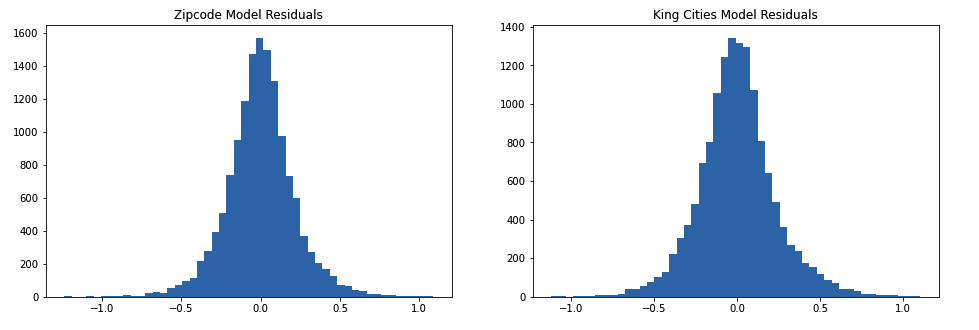
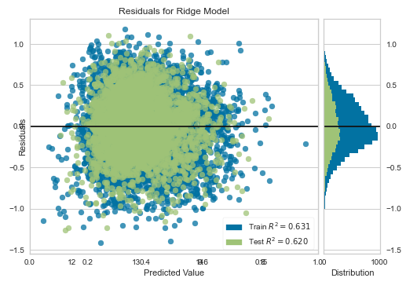

# King County Housing Analysis for King County Realtors
Authors: Jonny Hofmeister and Tosca Le


## Overview

This project explores different components of location and details of homes in King County, which is located in Washington state of the U.S. and encompasses the greater area of Seattle. The data has been provided by Flatiron School, and the project requires us to use linear regression models to generate data driven insights. 

In addition to this README, there is a combined analysis and summary of the work done individually by group partners, Tosca Le and Jonny Hofmeister. Features and insights from the separate models are combined here to summarize our results and findings for the stakeholder presentation. Analyses for the separate location and details models can be found in the branches Jonny and Tosca, respectively. 
***

## Business Problem

As a real estate agency in Seattle, King County Realtors wants to assist homeowners who are looking to buy and sell homes in King County. By understanding our analysis of the house sales data, they can give useful advice to homeowners on how location and characteristics of the home might affect the estimated value of the home.

The scope of this regression analysis is determined by the data and features we have access to. For example, this analysis can find the dependency and generally predict price for the zipcodes given in the King County data, but not for zipcodes outside of it; and it can find the trend for how the number of bedrooms effect price as long as this value is not way outside the range of the data. It is important the realtors understand this scope, so they can properly apply this analysis to future homes/data.
***

## Data

The King County House Sales dataset includes over 20,000 unique homes.

The target variable in the data for this regression is price. There are 19 other columns left at our disposal to use as predictors. Some like 'sqft_living' are very useful, while others like 'id' and 'date' are not as practical.

***


## Methods

In order to add context for the linear regression models, the columns were split into separate models. We created two models, one generated from location based features of a home, such as zipcode and neighbor lot size, and a second model generated from home-specific features, such as number of bedrooms and the overall condition of the home.

Both these analyses will explore the dependency of price on features, but will provide two different contexts in which KC Realtors can examine how location and home separately influence the price of homes.

Data preparation entailed cleaning for missing and unwanted values, selecting columns from interest from the data, one-hot encoding, logging and scaling, and finally train/test splitting. The distribution of predictors and multicolinearity were also validated prior to fitting for models.

***


## Results

The main metric we relied on to validate model fit is the Coefficient of Determination, commonly know as the R-squared value, which tell us the how much of the variance in our data the model could account for. The loss function used to evaluate predictive error in the model is Root Mean Square Error, which computed the average residual error across all predictions.

The threshold of perfomance we are seeking for a well-fit model is an R-squared value above 0.8. 

#### *Location Model:*

The zipcode model was able to explain the most variance in the data; it produced a model with an R-squared of 0.835 on the training set, and 0.833 on the testing set. This means that we can use the features and coefficients given in the model to explain 80% of the variance in price. The average error for a single prediction is 147k. 

The city/suburb model performed slightly worse, but it was still able to account for over 80% of the variance in the data; the R-squared for the training set was 0.804, so above the threshold, and quite well above the R^2 for the baseline model.

Residuals for both the Seattle Suburb model and Zipcode model were produced and shown in the graphs below:



#### *Home Model:*

The home models were not as successful as the location models when considering a threshold of performance for well-fit models. In the initial model and first iteration, by not utilizing bathroom or grade predictors, the model accounted for approximately 52-53% of the variance in price, respectively. After un-logging the results of RMSE, the initial model had an RMSE of about 257,118 dollars, which is very high and has implications if this were to be used to predict prices for a single home.

For the last iteration, the original bathrooms column was used and grade was added as a predictor. This model had the highest R-squared value of 0.641 and 0.628 on the testing set. RMSE was still high (220,667) but much lower than the other iterations.

Residuals for the final home model are shown below:


***


## Conclusions

Through these modeling efforts, we were able to offer insight on how location and home features influence price. KC Realtors should be able to highlight these features and help potential clients who are looking to buy or sell homes in King County, Washington. 

* The areas that may negatively impact price are Auburn, Covington, Des Moines, Federal Way, Kent, and Tukwila.
* The rest of the areas all positively impact price. Cities whose coefficient are greater than 0.7 are Ballard, Bellvue, Capital Hill, Madrona, Magnolia, Medina, Mercer Island, Queen Anne, and University district. Medina area has the highest influence on price, with a coefficient of 1.34.
* Square footage of the home is a significant predictor. In the first model, going up one standard deviation increases price by a factor of 0.3597. Through each iteration, the coefficient fluctuates and in the last model, 0.1711. Home square footage accounted for a greater portion of price when compared to the year the home was built, the number of bedrooms, bathrooms and floors.
* For condition, only a score of 5 has a significant p-value (0.014). With a lower score, comes a higher p-value and decreasing coefficient. Similarly, a higher grade, specifically 9-13, appears to have the largest positive impact, even more than square home footage. Grade scores of 11-13 have a coef of over 1.1.

### Next Steps

Additional steps are outlined to how we can make our models even more successful in order to futher assist KC Realtors:

* Other location boundaries besides zipcode could be tested, like US census tract because it is available information and has been shown to be a good predictor of other things, and school district boundaries as it is something commonly searched for by people buying a family home and could provide useful information to realtors' customers.
* Incorporating other predictors can be helpful in further understanding what influences home prices. Specifically, how the total square footage is dispersed between above ground and the basement, what year a home was renovated, and how total square footage might relate of its neighbors since these relate to ones that were used in the home model.
* Combining the successes of our models into a single one that includes all features of a home will hopefully produce better fit and reduce error as we have more features we know can successfuly account for variation in the data.
* Another way to reduce prediction error is to create different models for different tiers of price. By grouping price into subsets of the data, we may be able to create models that predict more accurately for certain types of homes. Realtors would then be able to narrow down their prediction if they were confident in their price classification of the home.
***

## For More Information

Please review our analysis in each of our Jupyter Notebooks, [Tosca's](./tosca_king_county_housing_analysis.ipynb), [Jonny's](./jonny_king_county_analysis.ipynb), or our [presentation](./).

For any additional questions, please contact us at **toscatle@gmail.com** and **jonny.hofmeister@gmail.com**.

## Repository Structure


```
main
├── data
├── images
├── .gitignore                          
├── README.md 
├── king_county_housing_analysis.ipynb                                  
└── king_county_housing_analysis_presentation.pdf
jonny
├── data
├── .gitignore                          
├── functions.py 
├── jonny_kc_scratchpaper.ipynb
├── jonny_king_county_analysis.ipynb                                  
└── zipcode_map.ipynb
tosca
├── data
├── .gitignore                          
├── functions.py 
├── king_county_housing_data_prep.ipynb                                 
└── tosca_king_county_housing_analysis.ipynb                             
```
